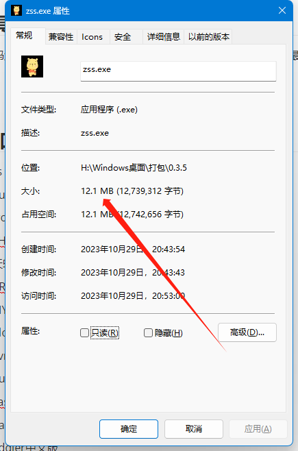
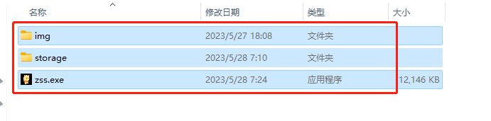
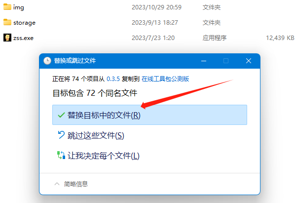
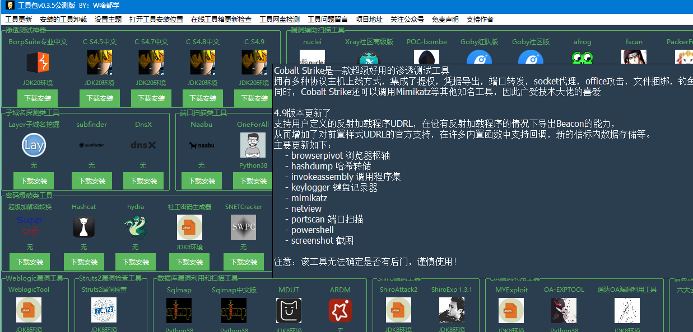
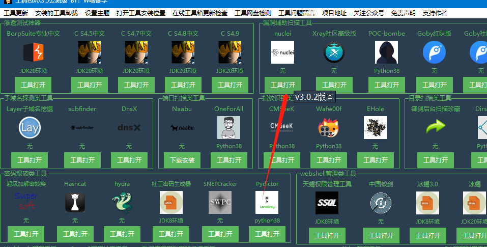
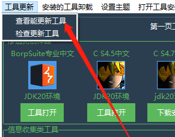
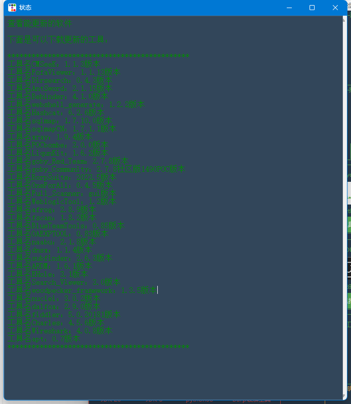
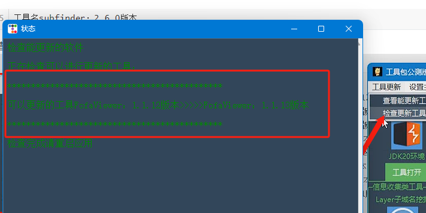
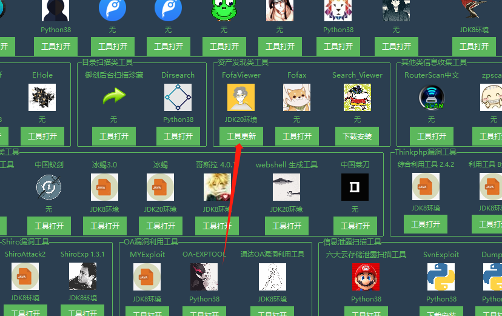

> 本工具源码无任何后门代码，工具箱里面的破解工具是否有后门就不清楚了大部分都是在别的公众号下载的，工具箱里面的不是破解版本的工具都是从官方下载的可以放心使用！

>   目前最大的问题就是网盘问题，你们下载的时候安装失败基本上都是后端提供下载的网盘出现问题了，之前工具下载是调用的阿里云，时间长点就会封号，现在部分工具下载放到的我的服务器，服务器的带宽很小下载人多就会下载速度很慢 

> 有好用的工具可以投稿邮箱2737977997@qq.com或者联系作者本人

## 非常感谢下面的团队和信息安全研究人员的一些工具推荐

- 天启实验室
- 法克安全
- Pings
- 成都第一深情
- 还原设置
- 夜梓月
- SY
- 平平无奇的水蜜桃
- 火柬
- 向

## 工具包介绍

> 该工具是一个类似软件商城的工具可以进行工具下载，工具的更新，工具编写了自动化的安装脚本，不用担心工具跑不起来

## 工具大小

源代码还是和上个公测版差不多，搞了一点代码的优化，最终写完还是和上个公测版差不多有六千多行、最后打包12MB

## 打包离线版本的方法

工具和启动环境都会下载到`storage`文件夹里面，把这三文件夹压缩就就可以了，到其他系统不需要在从工具箱里面的工具了

## 工具更新方法

如果下载了0.3.1或者之前版本要更新使用0.3.5版本，把0.3.5版本的文件覆盖0.3.1或者之前版本文件就可以了，就可以直接使用0.3.5版本了

覆盖就可以了

## 简单工具使用说明

1. 我们把鼠标放到工具图标上可以看工具的介绍

   

2. 下载好的工具可以叫鼠标放到打开按钮上可以看见版本

   

3. 查看可以根据更新的工具

   点击查看更新、里面的工具是可以官方版本更新我在推送到网盘里面你们可以进行工具的更新

    （工具箱里面的工具如果作者更新频繁、我这边会添加到可以更新名单里面、如果半年多以上没有更新的我没有添加更新列表里面） 

   

   可以更新的

   

4. 检查可以更新的工具

   

   我们可以工具更新

   

## v0.3.5增加新工具
- cs 4.9
- nuclei
- woodpecker_framework
- EHole
- 天蝎权限管理工具
- ARDM（AnotherRedisDesktopManager）
- MYExploit
- Cloud_Bucket_Leak_Detection_Tools
- SvnExploit
- dumpall
- FastjsonScan
- dalfox
- fiddler中文版
- Charles中文版
- Seay
- Wireshark
新功能添加

这个版本添加了一个网盘检测功能，可以检测网盘的工具包的状况，这个是因为在之前版本里面很多下载不了，或者是安装失败，基本上都是工具网盘的问题，所以添加了这个检测的功能

## v0.3.1公测试版更新功能

增加新工具
- Yasso
- Fofax
- zpscan
- pydictor
- mdut（Multiple Database Utilization Tools）
- Apt_t00ls
- 中国菜刀2016

新功能添加

1. 取消了运行cmd的状态窗口

   取消了下面的cmd运行状态窗口

2. 下载功能更新

   增加显示到了状态里面

   

   3. 工具卸载功能

   

4. 在线工具箱本身更新检查
   

5. 两个工具页

   应为新的工具一页放不下增加了一页

6. 解压功能

   解压的时候会弹出解压框，解压完成自动关闭解压框
   

## v0.22.1修复公测试版更新功能

1. **网盘出现问题在0.22之前的全部版本都不能下载工具了**，这几天很多人说工具下载不了了，这几天加班解决这个问题

   出现这个不能下载工具的原因是应为工具存储的网盘有改变，网盘用的是阿里云的、用的AList调用的，AList的策略更新了下载地址有变化，程序无法文件下载的文件名导致的这个问题

2. 还有就是下载工具的时候调用的系统命令进行下载的新版本的windows系统下载可能没有问题但是老版本的windows系统就无法下载，然后增加了内置下载程序无需在调用系统命令进行下载

## v0.22测试版更新功能

上一个版本窗口太大了这个版本窗口字体和图标变小

工具添加：SNETCracker工具、Jboss漏洞检查工具、OA漏洞检查工具、Naabu、DnsX、subfinder 

## v0.2测试版更新功能

1. 鼠标放到工具图标上可以看见工具的简单说明

   

2. 添加了更新功能、点击查看更新、里面的工具是可以官方版本更新我在推送到网盘里面你们可以进行工具的更新

    （工具箱里面的工具如果作者更新频繁、我这边会添加到可以更新名单里面、如果半年多以上没有更新的我没有添加更新列表里面） 

   

   点击检查更新

   

   我们就可以进行工具的升级

   

3. 下面好的工具我们可以叫鼠标放到按钮上查看工具版本

   

4. 添加测试网盘是否正常，很多不可控因素不正常你们工具就下载不了，不正常可以联系我，会进行修复

   如果是没有连接网络会报下面的情况

   

## v0.1

该工具是在线下载工具，用到什么工具就可以下载安装什么工具

工具本来是做linux工具箱用的，开发开发就开发到windows上了，开发一个星期左右完成

工具大小非常小！！！！py打包的文件很大5555

## 免责声明：

***
### 1. 该安全工具仅供技术研究和教育用途。使用该工具时，请遵守适用的法律法规和道德准则。

### 2. 该工具可能会涉及安全漏洞的测试和渗透测试，但请在授权的范围内使用，否则和作者无关

### 3. 使用该工具可能会涉及到一定的风险和不确定性，用户应该自行承担使用该工具所带来的风险。
### 4. 工具箱的工具有您合法权益问题可以联系我第一时间删除。
### 5. 使用本工具的用户应自行承担一切风险和责任。开发者对于用户使用本工具所产生的后果不承担任何责任。
