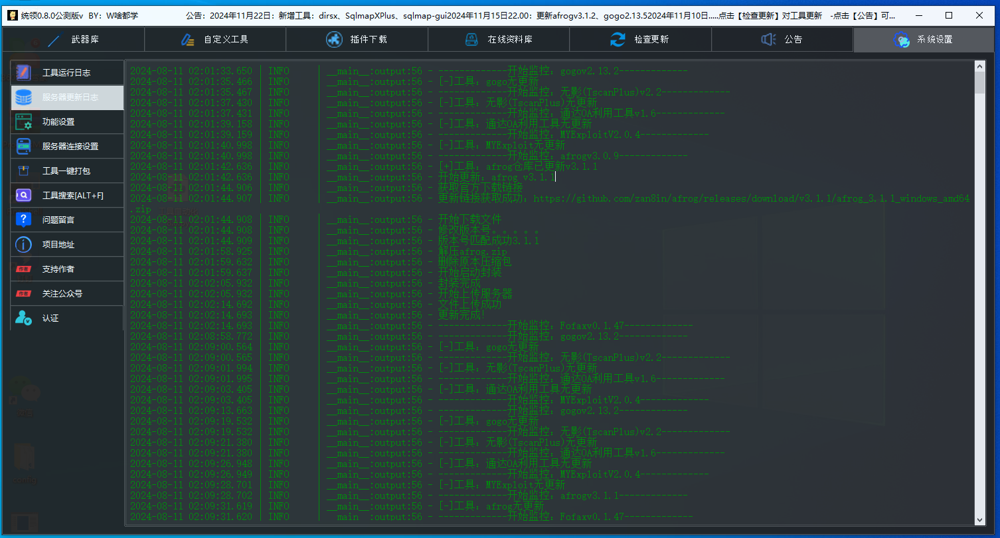
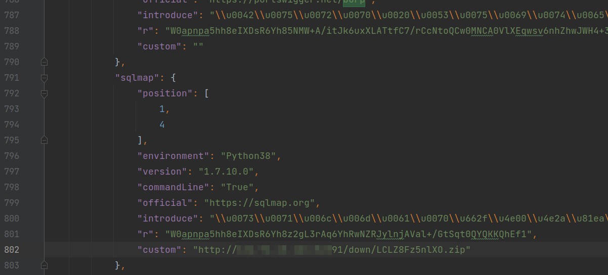

## 目前正在大力增加护网工具。。。。

## ⚠️免责声明：

***
1. 本安全工具仅供技术研究和教育用途。使用该工具时，请遵守适用的法律法规及道德准则。

2. 用户应遵守《中华人民共和国网络安全法》，并且不得将该工具用于未经授权的测试或非法活动。否则，用户自行承担所有责任，与工具作者无关。

3. 本工具可能涉及安全漏洞测试和渗透测试，请仅在合法授权范围内使用，否则用户需自行承担风险，且与工具作者无关。

4. 本工具附带使用教程，仅提供学习使用。请确保仅在授权的情况下参考和执行教程内容。否则用户需自行承担风险，且与工具作者无关。

5. 如该工具涉及侵犯您的合法权益，请及时联系工具开发者，开发者将在第一时间处理并删除相关内容。

6. 使用本工具的用户应自行承担一切风险和责任。开发者不对因使用本工具产生的任何后果承担责任。

7. 使用本工具可能存在一定的风险和不确定性，用户应自行评估并承担所有相关风险。

## ⚡非常感谢下面的团队和信息安全研究人员的一些工具推荐

- 天启实验室
- 法克安全
- Pings
- 成都第一深情
- 还原设置
- 夜梓月
- SY
- 平平无奇的水蜜桃
- 火柬
- 向
- st.ANGER
- 远方
- start

> 全工具打包版下载
> 
> 百度网盘：https://pan.baidu.com/s/1MY2sfIJdF1RGRqB_eHRJ1A 提取码:r753
> 
> 夸克网盘：https://pan.quark.cn/s/ba27e6401004

> 有好用的工具可以投稿到这https://github.com/CuriousLearnerDev/Online_tools/issues/35

## 🔥工具介绍

该工具专为运维和安全检查和学习研究设计，类似于软件商城，可以实现工具下载、更新，并提供自动化安装脚本。对于信息安全专业的学生而言，不用担心工具无法正常运行配置，提升学生学习效率。

集成了类型工具如下：
- 全部运维&甲方&防守方工具：应急响应、内存马查杀、日志分析、流量抓包、代码审计、反编译/逆向、应急流程和说明
- 全部信息收集工具：子域名探测、端口扫描、指纹识别、目录扫描、资源发现、信息泄露
- 漏洞利用工具：中间件/CMS/框架漏、OA/应用漏洞、Webshell管理、漏洞扫描、数据库漏洞、XSS漏洞、综合利用
  

## 漏洞库系统介绍

关于漏洞采集系统：

1.5版本基本上花了很长时间去写自动化漏洞采集系统他会自动化爬取微信公众号漏洞Poc，Gihtub采集漏洞代码采集，监控各种漏洞平台（x里云，x安信，x创宇，x盟等）判断采集利用Poc，会根据漏洞名称是否有POC/EXP提取关键字自动化去搜索引擎（支持谷歌、Bing）和Gihub搜索爬取和提取数据，监控xxhub、nuclei、exploitdb等漏洞利用平台

2.0主要新增了github内容的漏洞exp/poc的监控，目前漏洞采集近6w，安全考虑目前还不对放公开版统领工具开放

## 工具大小

该工具使用的是Tkinter开发，Tkinter开发小工具还好，功能界面越复杂开发起来真的要吐血了，最终打包

大小如下：

## 0.8.0更新新增

- 界面美化
- 新增应用界面
- 新增右键工具图片快速工具文档使用（2024年11月23日目前已经更了nc、sqlmap、360星图、subfinder、nmap使用文档后续持续更新）
- 界面布局修改
- 新增在线资料库（目前只能查看在线资料后续更新）

## 新版本界面更

python的tk开发美化成这样了已经很难了，美化的快吐了，tk开发小工具还好开发大点功能的东西就得吐血了！

## 工具使用

### 1、命令行启动显示

命令行模式的工具都会有运行说明

### 2、工具更新

如果要检查工具有没有更新可以点击【检查更新】（他会检查新增和更新的工具）

看见有新工具增加了

### 3、查看工具使用文档

2024年11月23日目前已经更了(nc、sqlmap、360星图、subfinder、nmap使用文档后续持续更新）

右键图标下载文档

然后右键打开

### 4、工具设置

可以根据自己的设置界面样式

上面图片里面不是有一个设置网络请求吗，这个关闭的时候该工具就不会检查发送然后外部请求了（比如启动程序的时候他会自动检查更新和更新公告内容）

可以设置界面显示

有三种选择

如下：

### 5、添加自己下载连接

如果自己有服务器可以打包我的包然后上传服务器叫下载地址放到

全部的工具下载配置文件在storage/toollist.json文件里面里面有一个空的参数

这个参数就是对用的工具自定义下载地址，支持7z、zip、rar压缩方式

演示

叫下载好的工具把上传到服务器

上传到服务器上面

然后叫这个下载链接放到custom里面，

他就不会调用作者的下载地址了

### 添加自己的自定义工具

这个功能我是真的写浪费了我一个周六周日周末的时间写出来的功能，真的要多多支持呀

下面我就详细说一下这个功能的使用

界面依旧很丑！

我们随便点击一个添加按钮，如果我点击了是那个按钮就会自定义工具添加到选择的一行里面

- 第一个工具名称：这个没有什么好说的就是添加的工具名称
- 第二个工具显示位置：我们叫图标的显示的位置
- 第三个工具图标：这个也没有什么好说的就是工具的图标
- 第四个程序启动的文件：我们的启动程序的文件
- 第六个选择启动环境：就是启动程序的需要的环境，这个一共有4个选择可以选择python3.8、JDK8、JDK20、无需环境这几个选项（使用的是工具内部的环境然后没有安装会自动下载）
- 第七个选择显示方式：这个就是你选择的工具的启动模式，然后是图形界面的就选择图形界面的，如果是命令行的就选择命令行的
- 第八个添加参数：这个就是我们运行的后面的参数，比如我们运行一个nmap -h，这个-h就是我们添加的默认启动的参数

下面是详细的说明

#### 1、第一个工具名称：

这个没有什么好说的就是添加的工具名称

#### 2、第二个工具显示位置：

这个我演示一下应该就可以明白了

比如我添加一个工具位置是1

然后这个工具是在这

然后我添加一个大于等于2的位置他就会下面这样

然后这个工具的位置就变成了这样

#### 3、第三个工具图标：

这个也没有什么好说的就是工具的图标

#### 4、第四个程序启动的文件：

这个启动是文件就是然后你是比如sqlmapq启动文件就是如下

下面就是sqlmap的启动文件

在如果比如是冰蝎工具

下面是他的启动文件

在在如果是goby

下面是他的启动文件

#### 5、第五个工具版本：

这个也没有什么好说的就是工具的版本

下面这个输入什么图标版本就显示什么

#### 6、第六个选择启动环境

这个一共有4个选择可以选择python3.8、JDK8、JDK20、无需环境这几个选项

这个选择如果你是sqlmap这样的python的运行环境你就选择运行环境

运行自定义工具的简单原理就是这样 python运行地址加工具运行地址

图片

在运行源码层面上其实比这个复杂一点，如果是命令行程序会生成一个一个start的文件夹然后在创建一个文件里面会生成一个工具的启动文件，你们用户就不用了考虑怎么多选择就完事了，GUI点点就完事了

#### 7、第七个选择显示方式：

这个就是你选择的工具的启动模式，如果是图形界面的就选择图形界面的，如果是命令行的就选择命令行的

#### 8、第八个添加参数

这个就是我们运行的后面的参数，比如我们运行一个nmap -h，这个-h就是我们添加的默认启动的参数（可以忽略不加也可以）

简单大概下面这样

#### 自定义添加工具的案例

我们还是那sqlmap做演示

我在github叫sqlmap下载下来然后解压出来了，在`C:\sqlmap-master`

然后添加就这样添加

添加完成这个就显示了

我们就可以点击运行了

 

## 之前版本

## 新版本界面更新说明

### 1、简单的界面

第一次打开工具会有一个提示选择全显示和分类显示

1、 全工具显示

2、分类显示

然后后面想设置，可以在设置里面设置

### 2、右键查看工具使用教程

目前我还在整理现在有时候比较忙没有时间搞，后面有更新，后面你点击更新会更新工具使用教程

### 3、一键打包

可以一键打包全部和打包防守工具（只打包已经下载好的）打包格式是zip格式

### 4、工具优化

这个版本优化的太多了下面简单说一下

- 下载完成后安装完成提示确定点击后关闭下载窗口
- 下载完插件提示确定自动打开下载好的插件路径
- 等等等。。。。。

## 0.5.0公测版本新功能添加

### 增加新工具

- yakit
- SBSCAN

### 更新了什么

这个版本更新很多功能，下面我就说一下改动比较大的一些功能

- 自定义工具添加
- 改成了点击图标启动工具，下载工具，更新工具
- 添加自定义界面的设置
- 全局快捷键工具的搜索，可以按`alt+d`键快速弹出
- 下载卸载更新添加自动刷新界面
- 代码的运行优化

## 0.4.0公测版本新功能添加

增加了工具搜索功能，可以按`alt+d`键快速弹出

## v0.3.5增加新工具

- cs 4.9
- nuclei
- woodpecker_framework
- EHole
- 天蝎权限管理工具
- ARDM（AnotherRedisDesktopManager）
- MYExploit
- Cloud_Bucket_Leak_Detection_Tools
- SvnExploit
- dumpall
- FastjsonScan
- dalfox
- fiddler中文版
- Charles中文版
- Seay
- Wireshark
新功能添加

这个版本添加了一个网盘检测功能，可以检测网盘的工具包的状况，这个是因为在之前版本里面很多下载不了，或者是安装失败，基本上都是工具网盘的问题，所以添加了这个检测的功能

## v0.3.1公测试版更新功能

增加新工具
- Yasso
- Fofax
- zpscan
- pydictor
- mdut（Multiple Database Utilization Tools）
- Apt_t00ls
- 中国菜刀2016

新功能添加

1. 取消了运行cmd的状态窗口

   取消了下面的cmd运行状态窗口

2. 下载功能更新

   增加显示到了状态里面

   

   3. 工具卸载功能

   

4. 在线工具箱本身更新检查
   

5. 两个工具页

   应为新的工具一页放不下增加了一页

6. 解压功能

   解压的时候会弹出解压框，解压完成自动关闭解压框
   

## v0.22.1修复公测试版更新功能

1. **网盘出现问题在0.22之前的全部版本都不能下载工具了**，这几天很多人说工具下载不了了，这几天加班解决这个问题

   出现这个不能下载工具的原因是应为工具存储的网盘有改变，网盘用的是阿里云的、用的AList调用的，AList的策略更新了下载地址有变化，程序无法文件下载的文件名导致的这个问题

2. 还有就是下载工具的时候调用的系统命令进行下载的新版本的windows系统下载可能没有问题但是老版本的windows系统就无法下载，然后增加了内置下载程序无需在调用系统命令进行下载

## v0.22测试版更新功能

上一个版本窗口太大了这个版本窗口字体和图标变小

工具添加：SNETCracker工具、Jboss漏洞检查工具、OA漏洞检查工具、Naabu、DnsX、subfinder 

## v0.2测试版更新功能

1. 鼠标放到工具图标上可以看见工具的简单说明

   

2. 添加了更新功能、点击查看更新、里面的工具是可以官方版本更新我在推送到网盘里面你们可以进行工具的更新

    （工具箱里面的工具如果作者更新频繁、我这边会添加到可以更新名单里面、如果半年多以上没有更新的我没有添加更新列表里面） 

   

   点击检查更新

   

   我们就可以进行工具的升级

   

3. 下面好的工具我们可以叫鼠标放到按钮上查看工具版本

   

4. 添加测试网盘是否正常，很多不可控因素不正常你们工具就下载不了，不正常可以联系我，会进行修复

   如果是没有连接网络会报下面的情况

   

## v0.1

该工具是在线下载工具，用到什么工具就可以下载安装什么工具

工具本来是做linux工具箱用的，开发开发就开发到windows上了，开发一个星期左右完成

工具大小非常小！！！！py打包的文件很大5555

✨随着时间的推移，观星者

