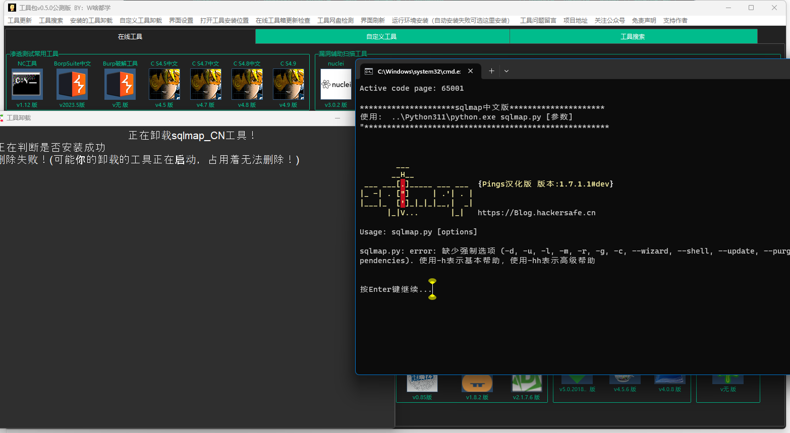

> 本工具源码无任何后门代码，工具箱里面的破解工具是否有后门就不清楚了大部分都是在别的公众号下载的，工具箱里面的不是破解版本的工具都是从官方下载的可以放心使用！

>   目前最大的问题就是网盘问题，你们下载的时候安装失败基本上都是后端提供下载的网盘出现问题了，之前工具下载是调用的阿里云，时间长点就会封号，现在部分工具下载放到的我的服务器，服务器的带宽很小下载人多就会下载速度很慢 

> 有好用的工具可以投稿邮箱2737977997@qq.com或者联系作者本人

## 非常感谢下面的团队和信息安全研究人员的一些工具推荐

- 天启实验室
- 法克安全
- Pings
- 成都第一深情
- 还原设置
- 夜梓月
- SY
- 平平无奇的水蜜桃
- 火柬
- 向

> 现在简单统计了一下大概有80个渗透工具左右，3个运行环境，1个破解工具

## 工具包介绍

> 该工具是一个类似软件商城的工具可以进行工具下载，工具的卸载，工具的更新，工具编写了自动化的安装脚本，不用担心工具跑不起来

## 工具大小

这个版本在源码层面上修改添加了很多，从之前的优化代码越来越少到现在添加了2千多行的代码量，添加更多功能，运行速度更快，占用资源更少

现在原代码大概一万行左右最终打包和之前差不多12MB比之前少了几百kb左右

## 新版本界面

## 打包离线版本的方法

工具和启动环境都会下载到`storage`文件夹里面，把这三文件夹压缩就就可以了，到其他系统不需要在从工具箱里面的工具了

## 更新工具

如果下载了之前版本要更新使用0.5.0版本，把0.5.0版本的文件覆盖之前版本文件就可以了，就可以直接使用0.5.0版本了

覆盖就可以了

## 新功能添加

1、修复下载文件错位问题

2、这个版本更新功能

- 更换使用模式
  全工具显示 模式
  工具分类显示 模式
- 每次打开工具都弹窗提示，改成每天就弹窗一次
  （因为每次打开工具都要弹窗真的很烦人！）

## 工具使用

现在工具的功能有的多，我这边还是出一个工具的使用教程吧

### 切换使用模式

#### 全工具显示

#### 工具分类显示

### 查看工具的介绍

这个版本查看工具的介绍和上个版本有差别，这个是叫鼠标放到工具的名字是查看工具的介绍

### 工具箱里面的工具下载

点击要下载的工具

安装完成

我们就可以添加图标运行工具了

#### 首次安装工具的整个过程和说明

工具在没有安装的情况下图标是灰色加上下载图标

我们可以点击图标下载工具，下面我就下载一个sqlmap进行演示

这边会下载和压缩安装

然后首次安装python相关运行环境的工具，比如我们下载的sqlmap他会自动检测这个是否下载了python（这个运行环境是在工具内部的运行环境不会和系统变量冲突放心下载），然后会如下提示，我们这边需要下载，然后是其他的需要java的运行环境如果是首次下载工具也会自动检测下载java工具的相关版本

这个然后就开始下载工具内部的python运行环境了

然后全部都没有检查安装到运行环境

我们可以选择手动安装工具内部的运行环境

### 工具箱里面的工具更新

如果有工具更新了，我们可以进行工具的更新

点击下面下面这个更新，这个和上个版本有改动，上个版本有两个选项，上个版本有人说工具箱里面的工具不会更新，我就把两个选项变成了这个一个

如果有工具的更新，会出现下面的情况，自动刷新界面更新

### 工具的卸载

工具的卸载我这边就随便写了一下反正很丑

比如我卸载sqlmap

然后成功被卸载

有一点卸载不掉的情况就是你正在运行这个工具是卸载不掉的

如：

### 添加自己的自定义工具

这个功能我是真的写浪费了我一个周六周日周末的时间写出来的功能，真的要多多支持呀

下面我就详细说一下这个功能的使用

界面依旧很丑！

我们随便点击一个添加按钮，如果我点击了是那个按钮就会自定义工具添加到选择的一行里面

- 第一个工具名称：这个没有什么好说的就是添加的工具名称
- 第二个工具显示位置：我们叫图标的显示的位置
- 第三个工具图标：这个也没有什么好说的就是工具的图标
- 第四个程序启动的文件：我们的启动程序的文件
- 第六个选择启动环境：就是启动程序的需要的环境，这个一共有4个选择可以选择python3.8、JDK8、JDK20、无需环境这几个选项（使用的是工具内部的环境然后没有安装会自动下载）
- 第七个选择显示方式：这个就是你选择的工具的启动模式，然后是图形界面的就选择图形界面的，如果是命令行的就选择命令行的
- 第八个添加参数：这个就是我们运行的后面的参数，比如我们运行一个nmap -h，这个-h就是我们添加的默认启动的参数

下面是详细的说明

#### 1、第一个工具名称：

这个没有什么好说的就是添加的工具名称

#### 2、第二个工具显示位置：

这个我演示一下应该就可以明白了

比如我添加一个工具位置是1

然后这个工具是在这

然后我添加一个大于等于2的位置他就会下面这样

然后这个工具的位置就变成了这样

#### 3、第三个工具图标：

这个也没有什么好说的就是工具的图标

#### 4、第四个程序启动的文件：

这个启动是文件就是然后你是比如sqlmapq启动文件就是如下

下面就是sqlmap的启动文件

在如果比如是冰蝎工具

下面是他的启动文件

在在如果是goby

下面是他的启动文件

#### 5、第五个工具版本：

这个也没有什么好说的就是工具的版本

下面这个输入什么图标版本就显示什么

#### 6、第六个选择启动环境

这个一共有4个选择可以选择python3.8、JDK8、JDK20、无需环境这几个选项

这个选择如果你是sqlmap这样的python的运行环境你就选择运行环境

运行自定义工具的简单原理就是这样 python运行地址加工具运行地址

图片

在运行源码层面上其实比这个复杂一点，如果是命令行程序会生成一个一个start的文件夹然后在创建一个文件里面会生成一个工具的启动文件，你们用户就不用了考虑怎么多选择就完事了，GUI点点就完事了

#### 7、第七个选择显示方式：

这个就是你选择的工具的启动模式，如果是图形界面的就选择图形界面的，如果是命令行的就选择命令行的

#### 8、第八个添加参数

这个就是我们运行的后面的参数，比如我们运行一个nmap -h，这个-h就是我们添加的默认启动的参数（可以忽略不加也可以）

简单大概下面这样

#### 自定义添加工具的案例

我们还是那sqlmap做演示

我在github叫sqlmap下载下来然后解压出来了，在`C:\sqlmap-master`

然后添加就这样添加

添加完成这个就显示了

我们就可以点击运行了

#### 自定义添加的工具卸载

### 工具的搜索功能

> 这个搜索功能不支持自定义工具的搜索

这个工具搜索功能是为了解决工具箱工具找不到的尴尬问题

可以按`alt+d`键快速弹出，工具搜索

或者是点击这个地方

在或者点击这个地方，进行工具的搜索

### 工具界面的修改

这个是解决有的屏幕分辨率小的问题的，和设置一些自定义主题的人群（工具界面太丑了设置什么样的主题也丑！）

我们可以设置一些工具的分辨率图标大小主题什么的

里面有两个地方可能有用户不懂我这边演示一下

1. 第一个就是工具的间距

   比如我设置50

   

   就变成了下面的效果

   

2. 名字换行

   

   13个字符自动换行

   

### 打开工具的安装路径

这个其实就是我们下载工具和运行环境安装的路径

### 在线版本检查

这个基本上没有啥用了，之前是为了点击更新工具箱，实现起来比较麻烦就没有更新这个功能，只能查看新版本更新了什么功能

### 工具网盘检查

这个是解决我们下载工具的时候，网盘出现了问题可能就会导致工具下载不了的情况，就写了一个网盘工具检查的功能，检查工具在网盘里面的状况

## 0.5.0公测版本新功能添加

## 增加新工具

- yakit
- SBSCAN

## 更新了什么

这个版本更新很多功能，下面我就说一下改动比较大的一些功能

- 自定义工具添加
- 改成了点击图标启动工具，下载工具，更新工具
- 添加自定义界面的设置
- 全局快捷键工具的搜索，可以按`alt+d`键快速弹出
- 下载卸载更新添加自动刷新界面
- 代码的运行优化

## 0.4.0公测版本新功能添加

增加了工具搜索功能，可以按`alt+d`键快速弹出

## v0.3.5增加新工具

- cs 4.9
- nuclei
- woodpecker_framework
- EHole
- 天蝎权限管理工具
- ARDM（AnotherRedisDesktopManager）
- MYExploit
- Cloud_Bucket_Leak_Detection_Tools
- SvnExploit
- dumpall
- FastjsonScan
- dalfox
- fiddler中文版
- Charles中文版
- Seay
- Wireshark
新功能添加

这个版本添加了一个网盘检测功能，可以检测网盘的工具包的状况，这个是因为在之前版本里面很多下载不了，或者是安装失败，基本上都是工具网盘的问题，所以添加了这个检测的功能

## v0.3.1公测试版更新功能

增加新工具
- Yasso
- Fofax
- zpscan
- pydictor
- mdut（Multiple Database Utilization Tools）
- Apt_t00ls
- 中国菜刀2016

新功能添加

1. 取消了运行cmd的状态窗口

   取消了下面的cmd运行状态窗口

2. 下载功能更新

   增加显示到了状态里面

   

   3. 工具卸载功能

   

4. 在线工具箱本身更新检查
   

5. 两个工具页

   应为新的工具一页放不下增加了一页

6. 解压功能

   解压的时候会弹出解压框，解压完成自动关闭解压框
   

## v0.22.1修复公测试版更新功能

1. **网盘出现问题在0.22之前的全部版本都不能下载工具了**，这几天很多人说工具下载不了了，这几天加班解决这个问题

   出现这个不能下载工具的原因是应为工具存储的网盘有改变，网盘用的是阿里云的、用的AList调用的，AList的策略更新了下载地址有变化，程序无法文件下载的文件名导致的这个问题

2. 还有就是下载工具的时候调用的系统命令进行下载的新版本的windows系统下载可能没有问题但是老版本的windows系统就无法下载，然后增加了内置下载程序无需在调用系统命令进行下载

## v0.22测试版更新功能

上一个版本窗口太大了这个版本窗口字体和图标变小

工具添加：SNETCracker工具、Jboss漏洞检查工具、OA漏洞检查工具、Naabu、DnsX、subfinder 

## v0.2测试版更新功能

1. 鼠标放到工具图标上可以看见工具的简单说明

   

2. 添加了更新功能、点击查看更新、里面的工具是可以官方版本更新我在推送到网盘里面你们可以进行工具的更新

    （工具箱里面的工具如果作者更新频繁、我这边会添加到可以更新名单里面、如果半年多以上没有更新的我没有添加更新列表里面） 

   

   点击检查更新

   

   我们就可以进行工具的升级

   

3. 下面好的工具我们可以叫鼠标放到按钮上查看工具版本

   

4. 添加测试网盘是否正常，很多不可控因素不正常你们工具就下载不了，不正常可以联系我，会进行修复

   如果是没有连接网络会报下面的情况

   

## v0.1

该工具是在线下载工具，用到什么工具就可以下载安装什么工具

工具本来是做linux工具箱用的，开发开发就开发到windows上了，开发一个星期左右完成

工具大小非常小！！！！py打包的文件很大5555

## 免责声明：

***
### 1. 该安全工具仅供技术研究和教育用途。使用该工具时，请遵守适用的法律法规和道德准则。

### 2. 该工具可能会涉及安全漏洞的测试和渗透测试，但请在授权的范围内使用，否则和作者无关

### 3. 使用该工具可能会涉及到一定的风险和不确定性，用户应该自行承担使用该工具所带来的风险。
### 4. 工具箱的工具有您合法权益问题可以联系我第一时间删除。
### 5. 使用本工具的用户应自行承担一切风险和责任。开发者对于用户使用本工具所产生的后果不承担任何责任。
